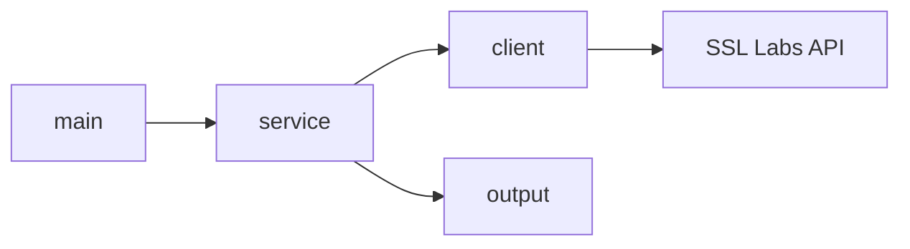
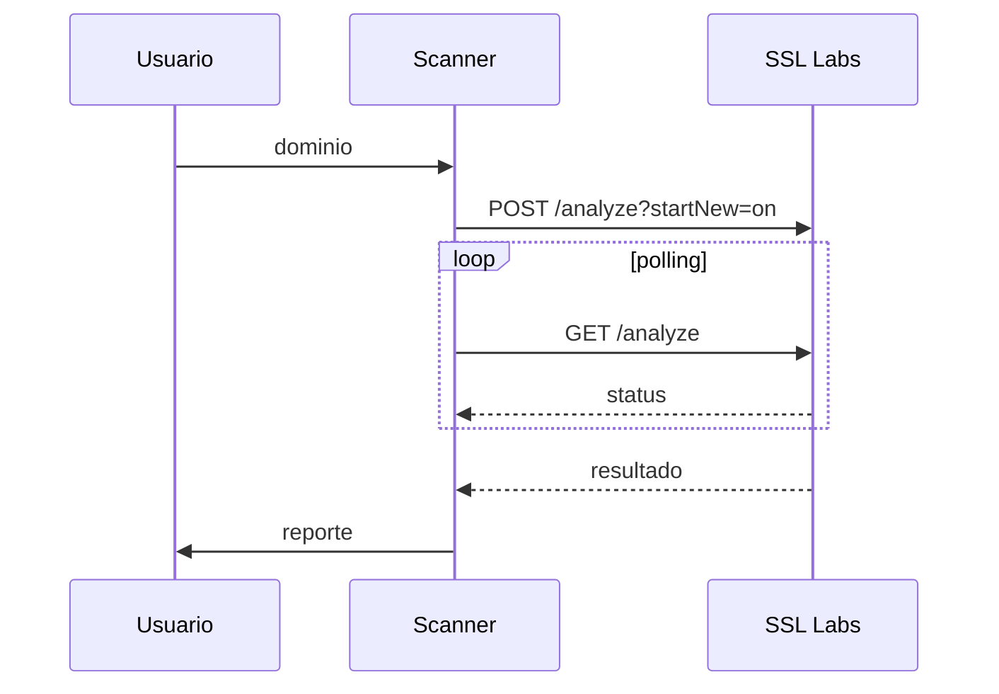

# SSL Scanner

Escáner TLS que consulta la API pública de SSL Labs para evaluar la configuración de seguridad de un dominio.

Proyecto desarrollado como prueba técnica para el semillero Nébula de Truora (Nebula Challenge).

## Challenge

[SSL Labs API Documentation](https://github.com/ssllabs/ssllabs-scan/blob/master/ssllabs-api-docs-v2-deprecated.md)

Este programa realiza un análisis TLS de un dominio utilizando la API pública de SSL Labs. El flujo incluye:
- Calificación general (A+, A, B, etc.)
- Protocolos TLS soportados
- Cipher suites
- Vulnerabilidades conocidas (Heartbleed, POODLE, BEAST, etc.)
- Información del certificado

## Uso

```bash
# compilar
go build -o sslscanner .

# analizar un dominio
./sslscanner ejemplo.com

# ver info del servicio
./sslscanner --info

# sin colores
./sslscanner --no-color ejemplo.com
```

## Estructura

```
sslscanner/
├── main.go          # punto de entrada
├── client/          # llamadas HTTP a SSL Labs
├── model/           # estructuras JSON de la API
├── service/         # lógica de negocio y orquestación
└── output/          # formateo de resultados
```

## Arquitectura



## Flujo de análisis



Realizado por Elkin Angulo - [GitHub](phttps://github.com/paelsam)
